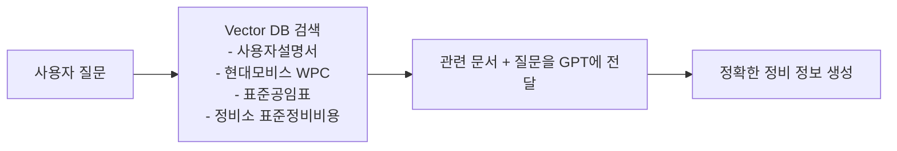

<h1 align="center">🚗 MotorHelp 🚗</h1>
<h3 align="center">AI 기반 자동차 정비 도우미 & 실차주 커뮤니티 플랫폼</h3>

<커뮤니티 서비스 시연 영상>
https://github.com/user-attachments/assets/344e57c8-da77-40db-8569-91702ed3abca

<챗봇 시연 화면>

  
  
  

MotorHelp는 **OpenAI API + RAG 기술**을 활용해  
차량별 **공식 매뉴얼**과 **표준 정비 데이터**를 기반으로  
정확하고 신뢰도 높은 정비 정보를 제공하는 AI 플랫폼입니다.

또한, 실차주 인증 시스템을 통해  
사용자들이 실제 경험을 바탕으로 정보를 공유할 수 있도록 하여  
투명하고 신뢰성 높은 자동차 커뮤니티 환경을 구축합니다.

________________________________________
## 📋 목차

- [프로젝트 소개](#-프로젝트-소개)
- [주요 기능](#-주요-기능)
- [AI 정비 챗봇 기술](#-ai-정비-챗봇-기술)
- [사용되는 RAG 데이터](#-사용되는-rag-데이터)
- [기술 스택](#-기술-스택)
- [시작하기](#-시작하기)
- [프로젝트 구조](#-프로젝트-구조)
- [현재 구현된 기능 & 향후 계획](#-현재-구현된-기능--향후-계획)
- [라이선스](#-라이선스)

________________________________________
# 🚀 프로젝트 소개
이 프로젝트는 자동차 오너를 위한 **정비 정보 제공 + 상담 챗봇 + 실차주 커뮤니티** 기반 서비스입니다.

핵심 구성 요소는 다음과 같습니다:

- AI 정비 챗봇(OpenAI API + RAG)
- 실차주 인증 시스템을 통한 신뢰도 높은 커뮤니티
- 차량 관리 기능(정비 일정, 비용, 고질병 안내)
- 주행거리 기반 맞춤형 정비 추천
- 정비소 자동 추천 기능(현재 간단한 추천 로직 기반)

---

# ✨ 주요 기능

## 1️⃣ AI 차량 정비 챗봇 (OpenAI API + RAG)

차량별 데이터 기반으로 아래 정보를 제공합니다:

- 차량별 정비 주기 안내
- 공식 정비 비용(부품값 + 공임)
- 고질병 정보
- 증상 기반 문제 추정
- 셀프 정비 가이드
- 주행거리 기반 정비 추천
- 정비소 추천 기능
- 사용자설명서 기반 RAG 검색

### 💬 예시 질문

- LF쏘나타 13만km인데 저속에서 덜컹 소리가 나요. 어디 점검해야 하나요?
- 정비소에서 스테빌라이저 교체하라고 하는데, 비용이 얼마정도 발생할까요?
- G80 엔진오일 교체 주기 알려줘.
- K5 하이브리드 고질병 알려줘.
- 내 차 10만km 넘었는데 어떤 정비해야 해?
- 주변 정비소 추천해줘.
________________________________________
🤖 AI 정비 챗봇 기술
AI 챗봇은 단순한 GPT 답변이 아니라, 차량별 데이터를 기반으로 한 RAG(Retrieval-Augmented Generation) 방식을 사용합니다.

### 🔍 RAG 처리 과정

________________________________________
## 📚 사용되는 RAG 데이터
AI 챗봇은 실제 정비 업계에서 사용하는 공식 데이터 기반으로 동작하는 RAG 시스템입니다.

### 📘 1. 차량별 공식 사용자설명서(매뉴얼)
- 제조사 정비 규격
- 정비 주기(10,000km / 20,000km 단위)
- 부품 규격
- 경고등 및 안전 관련 내용

### 🔧 2. 현대모비스 WPC (공개 부품 전산 시스템)
- 순정부품 번호(OEM Part No.)
- 부품 단가(공개 기준)
- 대체 가능 부품 목록

### 🧾 3. 표준공임표
- 국토부·정비조합 제공 표준 공임표 기반
- 소모품 공임 / 일반 정비 공임
- 차량군별(소형 · 중형 · 대형 · SUV) 공임 차이 반영

### 💰 4. 정비소 표준 정비비용 데이터
- 실제 정비소 기준 평균 공임
- 소모품 교체 비용
- 정액수리 항목 기준금액

________________________________________
🎯 챗봇이 제공하는 기능 요약
- 기능	설명
- 정비 주기 안내	(엔진오일, 미션오일, 보조밧데리 등)
- 정비 비용 안내	(부품값 + 공임 기반 실정비 비용)
- 차량별 고질병 조회	(모델별 커뮤니티·정비업계 기반 데이터)
- 증상 기반 고장 추정 (경고등·주행 거리 기반)
- 셀프 정비 가이드: 와이퍼, 필터류 등
- 주변 정비소 추천: 위치 기반 단순 알고리즘
- 주행거리 기반 정비 추천	(EX: 5만km / 10만km 기준 필수 정비 제공)
- 정비 난이도/예상 소요 시간 안내	(사용자설명서 + 공임 기준)
________________________________________

## 💬 차량 오너 커뮤니티

본 프로젝트는 단순한 AI 정비 챗봇이 아니라,  
차량 오너들이 직접 정보를 공유하고 서로 도움을 줄 수 있는 **실차주 기반 커뮤니티 플랫폼**을 핵심 기능으로 포함하고 있습니다.

### ✔ 1. 정비 후기 공유
- 오일 교환, 브레이크 패드 교체, 타이어 정비 등 실제 정비 경험 공유
- 모델별 정비 난이도, 정비 소요 시간, 실제 비용 등 현실적인 정보 제공

### ✔ 2. 차량 고질병 / 문제 사례 공유
- 각 차량 모델에서 자주 발생하는 고질병 정보를 실사용자가 직접 공유
- AI 챗봇의 RAG 데이터 + 실제 사용자 후기 데이터 결합

### ✔ 3. 사진·영상 기반 정보 공유
- 정비 전·후 사진
- 차량 DIY 작업 과정
- 차량 인증샷, 정비 비용 증빙 등 시각적 데이터 공유 가능

### ✔ 4. 차량별 정보 공유 게시판
- 차종별 태그 기반 게시판 구성
- 동일 차종 운전자끼리 정보 교류 가능

### ✔ 5. 실차주 인증 기반 투명한 커뮤니티 운영
- 차량 번호 + 소유자명 인증 후 게시글 작성 가능
- 실제 차량 보유자의 경험 중심 커뮤니티 형성
- 인증된 사용자는 차량 배지 획득 (자동 지급 기능은 향후 구현 예정)

### ✔ 6. 댓글 및 투표 기능(UI 구현 완료)
- 사용자 간 의견 교환 및 피드백 공유
- 정비 비용/부품 추천/문제 해결 방식 등을 투표로 공유 가능

________________________________________
## 🛠 기술 스택

### 🔹 Frontend
- React 18  
- TypeScript  
- Tailwind CSS v4  
- Lucide React  

### 🔹 Backend (챗봇)
- Python Flask  
- OpenAI API  
- LangChain  
- ChromaDB (RAG용 Vector DB)  
- Flask-CORS  

### 🔹 개발 환경
- Vite  
- ESLint  

________________________________________
🚀 시작하기
- Frontend 실행
- npm install
- npm run dev
- Backend 실행
- python -m venv venv
- source venv/bin/activate
- pip install flask openai langchain chromadb flask-cors
- export OPENAI_API_KEY="your-key"
- python chatbot_server.py
________________________________________
/📁 프로젝트 구조

/
├── components/
│   ├── ChatBot.tsx               # AI 챗봇 UI
│   ├── CommunityFeed.tsx         # 커뮤니티 피드
│   ├── CreatePost.tsx            # 게시글 작성 UI
│   ├── PostDetail.tsx            # 게시글 상세 페이지
│   ├── MyPage.tsx                # 마이페이지 + 차량 인증 UI
│   └── ui/                       # 공용 UI 컴포넌트 모음
│
├── backend/
│   ├── chatbot_server.py         # Flask + OpenAI 챗봇 서버
│   ├── rag_engine.py             # RAG 검색 엔진
│   └── data/                     # 벡터 DB + 매뉴얼/부품/공임 데이터
│
├── styles/
│   └── globals.css               # 전역 스타일
│
├── App.tsx                       # 전체 라우팅 및 메인 컴포넌트
├── CHATBOT_README.md             # 챗봇 상세 문서
└── MIGRATION_GUIDE.md            # 마이그레이션 가이드

________________________________________
## ✔ 완성된 UI 기능
### 🔹 커뮤니티 UI
- 게시글 목록 UI
- 게시글 상세보기 UI
- 댓글 UI (입력창, 리스트, 프로필, 타임스탬프 포함)
- 이미지 첨부 UI (게시글 작성 화면에서 선택 가능)
- 투표 기능 UI (투표 옵션 UI, 선택 인터페이스)
- 좋아요/추천 UI

### 🔹 계정 및 인증 관련 UI
- 로그인 UI
- 회원가입 UI
- 차량 인증 전체 UI 흐름
  - 차량 번호 입력 페이지
  - 소유자명 입력 페이지
  - 인증 진행 상태 UI
  - 인증 완료 화면
  - 공동명의 및 예외 안내 UI

### 🔹 마이페이지 UI
- 프로필 수정 UI
- 차량 목록 UI
- 게시글/댓글 기록 UI

### 🔹 기타 UI
- 하단 네비게이션
- 챗봇 화면 UI
- 정비 챗봇 예시 질문/로딩 UI
- 페이지 전환/반응형 레이아웃

---

## ✔ 향후 구현해야 하는 기능 (백엔드·데이터 연동 중심)

### 🔹 차량 인증 기능 완성
- 공공데이터 연동  
  (국토부 차량 정보 API를 통한 차량 번호 + 소유자명 검증)
- 차량별 자동 배지 지급 시스템
  - 차종 기반 아이콘 배지
  - 인증 배지
  - 활동 배지

### 🔹 커뮤니티 기능 완성
- 댓글 DB 저장
- 이미지 업로드 기능(Supabase Storage 등)
- 투표 데이터 저장 및 중복 방지
- 게시글·댓글 작성자 인증 연동

### 🔹 회원 시스템 및 인증 백엔드
- 로그인/회원가입 실제 기능 구현  
  (Supabase Auth 또는 Flask JWT)
- 세션/토큰 관리

### 🔹 서비스 기능 확장
- 정비 일정 자동 알림
- 차량별 정비 이력 자동 관리
- 정비소 제휴 및 챗봇 기반 예약 기능

________________________________________
📄 라이선스:
이 프로젝트는 개인 프로젝트입니다.

